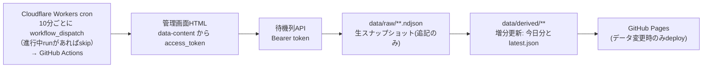

# queue-observer-jp

順番待ち(junbanmachi.jp)の待機列を10分ごとに観測し、**列消化速度**と**推定待ち時間**を GitHub Pages で公開する仕組みです。

観測対象: 盛岡駅みどりの窓口(shop_id=4268)

## 何を記録しているか

保存の中心は「処理速度」という計算結果ではなく、**各時刻の待機列と受付番号の状態**です。
処理速度は後から計算方法を修正できる派生値として、生データから再生成します。

このデータから分かるのは厳密には窓口の手続き完了速度ではなく、
**待機列から番号が抜けていく速度(列消化速度・呼出速度)**です。

## 収集の流れ



1. Cloudflare Workerが10分ごとに起動
   - GitHub APIで進行中の`collect`ワークフローをチェック
   - 既に実行中なら新しいdispatchをスキップ（キャンセル防止）
2. `https://admin.junbanmachi.jp/dashboard/waiting_guest?id=4268` を取得し、
   `<script id="script" data-content="...">` のJSONから `access_token` を抽出
3. `https://api.junbanmachi.jp/ajax/waiting/user?id=4268&answer1=-1&answer2=-1` に Bearer トークン付きで送信
4. レスポンスを正規化して `data/raw/` の NDJSON に1行追記
5. **増分更新**: 今日の営業日ファイルと `latest.json` のみ更新（10分間隔で完走できる速度）
6. データ変更があれば GitHub Pages にデプロイ（変更なしならスキップ）

### フル再生成

`push` イベント（コード変更時）や `node src/rebuild.js` の手動実行では、
全履歴から `data/derived/` を完全再生成します。
アルゴリズム修正や統計追加時にはこちらを実行してください。

## データ構成

```text
data/
├── locations.json                 観測地点の定義
├── status.json                    直近の取得成否(失敗時もコミットする)
├── raw/<地点>/YYYY/MM/DD.ndjson   生スナップショット(追記のみ、消さない)
└── derived/<地点>/
    ├── latest.json                サイト表示用の最新値
    ├── YYYY-MM-DD.json            その日のスナップショット要約と区間別派生値
    └── stats.json                 曜日×時間帯の履歴統計
```

生データ1行の例:

```json
{"schema_version":1,"location_id":"morioka-station-midori-no-madoguchi","observed_at":"2026-08-04T11:49:01+09:00","business_date":"2026-08-04","waitings_count":39,"pendings_count":5,"waitings_truncated":true,"waitings":[{"position":0,"number":203,"status":4}],"pendings":[{"position":0,"number":189,"status":5}]}
```

### 設計上の決まり

- `position` は API が返した配列順をそのまま保存する。配列順が実際の呼出し優先順を示している可能性があるため、番号順に並べ直さない。
- `observed_at` は GitHub Actions の予定時刻ではなく、HTTP取得が完了した実時刻。cronは遅れることがある。
- `raw` は追記専用で書き換えない。`derived` は `npm run rebuild` でいつでも作り直せる。

## 列消化速度の計算

### 受付番号の差は使わない

先頭が `167 → 177` に変わっても10組進んだとは限りません。番号には欠番・キャンセル・
`pending` へ移動した番号・別種別の受付・優先呼出が混ざります。
そのため**同一番号の存在・消滅・状態遷移**だけを追跡します。

```text
前回: 167, 175, 176, 177, 178
今回:                177, 178, 179, 180
                     ↑ 最初に生き残っている番号のインデックスが3 → 3組進んだ
```

前回の番号が今回すべて消えている場合は「少なくともN組進んだ」という下限しか分かりません。
その区間は `censored: true` として記録し、速度の平均には使いません。

### 区間ごとの状態遷移

| 分類 | 意味 |
| --- | --- |
| `still_waiting` | 前回 waitings → 今回も waitings |
| `moved_to_pending` | 前回 waitings → 今回 pendings |
| `unknown_exits` | 前回 waitings → 今回どこにもいない |

APIは待機列の先頭20件程度しか返さないため、列の並び替えが起きると `unknown_exits` が
過大に出ることがあります。主指標は先頭からの進捗数(`queue_advance_observed`)です。

### 速度計算から除外する区間

空いている時間を「速度0」として扱わないことが重要です。処理する利用者がいなかっただけで、
処理能力が0だったわけではありません。

- `queue_empty` 前後とも待ち0
- `queue_emptied` / `queue_empty_at_start` 区間内で列が空になった、または空から始まった
- `observation_gap` 観測が飛んだ(1時間超)
- `interval_too_short` 間隔が60秒未満
- `business_date_change` 営業日をまたいだ
- `number_reset` 受付番号がリセットされた
- 打ち切り区間(`censored: true`)

### 表示に使う速度

1区間だけの速度はばらつきが大きいため、直近60分をまとめて計算します。

```text
列消化速度 = 有効区間の queue_advance の合計 ÷ 有効な観測時間の合計
推定待ち時間 = 現在の待ち組数 ÷ 列消化速度
```

`latest.json` には直近20分・60分・120分の値を持たせ、表示には直近60分を使います。
直近60分に有効な観測がなければ120分、それも無ければ同じ曜日・時間帯の履歴平均へフォールバックします。

### pending の扱い

`pending` の意味(呼出済み・不在保留・案内直前など)が確定していないため、
待ち時間には加算せず「保留」として分離表示します。
`waitings → pendings → waitings` の復帰頻度が観測できたら、
`実効待ち組数 = waitings_count + α × pendings_count` の導入を検討します。

### 番号の一意キー

受付番号は翌日に再利用される可能性があるため、番号単体をキーにしません。

```text
location_id + business_date + number
```

## ローカルでの実行

```bash
node src/collect.js       # 1回観測して raw に追記し derived を増分更新
node src/rebuild.js       # 取得せず derived を全履歴から完全再生成
node src/build-site.js    # _site/ に公開用ファイルを組み立てる
node --test "test/*.test.js"
npm run serve             # ビルドしてローカルサーバで確認
```

Node.js 20 以上が必要です(組み込み `fetch` を使用、実行時の外部依存なし)。

## 観測地点の追加

`data/locations.json` に追記します。

```json
{
  "id": "some-station-madoguchi",
  "path": "some-station/madoguchi",
  "name": "表示名",
  "shop_id": 1234,
  "timezone": "Asia/Tokyo",
  "admin_url": "https://admin.junbanmachi.jp/dashboard/waiting_guest?id=1234",
  "api_url": "https://api.junbanmachi.jp/ajax/waiting/user?id=1234&answer1=-1&answer2=-1"
}
```

## 注意

非公式の観測記録です。表示される待ち時間は過去の観測から計算した目安で、
窓口数の変化や休憩時間は考慮していません。実際の待ち時間とは異なります。
